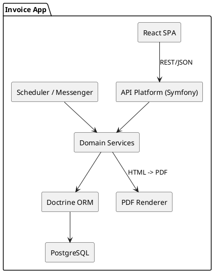
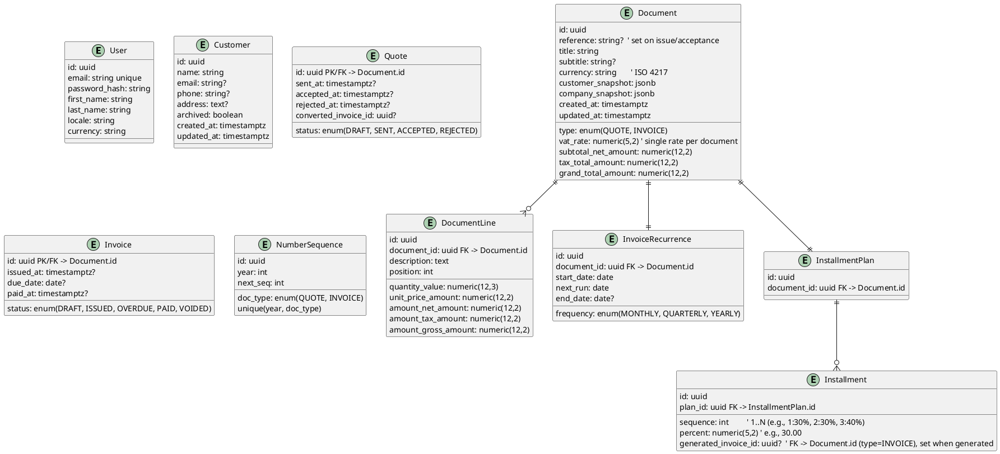

# Invoice Management System specifications

## Background

A personal invoicing and quoting system for a freelance web developer, built to **practice and showcase** a modern stack
while remaining **production-capable** and **contractor-implementable**.

**Key intent**

* Demonstrate a clean, hexagonal architecture with clear domain boundaries.
* Deliver a **single-user** app protected by auth, with pragmatic workflows: quotes, invoices, recurring invoices **or**
  installment plans (mutually exclusive), PDF for documents; CSV for reports, and a concise dashboard.
* Favor **Symfony + API Platform + Doctrine (PostgreSQL, UUIDv7)** on the backend and **React (Vite) + TypeScript/JSX +
  Tailwind + TanStack Query + RHF/Zod** on the frontend.
* Keep operations simple: **Dockerized dev and prod with environment parity** (Compose-based), optional Swarm/Kubernetes
  later, CI/CD via GitHub Actions.

**Out of scope for the MVP**

* Multi-tenant/team features, payments gateways, credit notes, and advanced accounting.
* Complex tax regimes; rely on a **single document-level VAT rate** snapshotted at creation.

**Success criteria (background-level)**

* The system can produce accurate quotes/invoices (including recurring or installment variants), render PDFs, and export
  revenue reports, all for a single authenticated user.
* The spec remains concise and non-overlapping so a scaffolder (codex) can generate a faithful skeleton.

## Requirements

### Product (MoSCoW)

**Must have**

* Single authenticated user (local admin) can manage **customers**, **quotes**, and **invoices**.
* **Company Profile** (embedded in `User`, editable from UI): `company_name`, `phone`, `siret`, full postal address, *
  *legal mentions**, **default VAT rate**, **default hourly rate**, **default daily rate**, and **company logo** (
  VichUploaderBundle). **User** also stores `first_name` and `last_name` (representative), separate from the company
  fields. Changes affect **future** documents only.
* **Document title** (required) and **subtitle** (optional) available on quotes/invoices and rendered in PDF.
* **Quote → Invoice** conversion with immutable snapshot of customer/tax/lines **and company profile** at conversion
  time.
* Document **statuses**: Draft → Sent → Accepted/Rejected (quotes); Draft → Issued → Overdue → Paid/Voided (invoices).
* **Document-level VAT** (single rate per doc), totals with net, tax, gross, rounding to 2 decimals.
* **Either** an **installment plan** *or* a **recurrence** schedule per invoice (mutually exclusive, enforced by domain
  rule).
* **Unique sequential references** per document type (e.g., `INV-YYYY-####`, `Q-YYYY-####`).
* **PDF render** for quotes/invoices; **CSV export** for revenue (by date range/status).
* Basic **dashboard**: totals YTD, MTD, top customers, unpaid/overdue count, upcoming installments/recurrences.
* **Archive/restore customers** (no hard delete of documents).
* **Internationalization-ready** numbers/dates for UI; ISO dates over API.

**Should have**

* **Duplicate** document (clone as Draft), **re-issue** with new reference.
* **Search/filter** lists by customer, status, date range.
* **Rate presets** (common VAT rates) selectable per document.

**Could have**

* **Line-item templates** and **customer defaults** (currency, VAT rate, locale).
* **Tags** on documents for custom reporting.

**Won’t have (MVP)**

* Multi-user/multi-tenant, payment gateways, credit notes, per-line multi-tax, inventory, or accounting journals.

### Non-functional

**Must have**

* **Reliability**: recurrence and installment jobs are idempotent; unique indices prevent duplicates.
* **Performance**: list views return in <300ms P95 on 5k documents; PDF generation <2s P95 for 1–3 pages.
* **Security**: local auth with salted hash; server-side input validation; audit fields (created/updated timestamps &
  user); HTTPS terminated at nginx with **HTTP/2** enabled; self-signed certs in dev (mkcert or equivalent) and managed
  certs in prod.
* **Operability**: Dockerized **dev and prod** with parity; one-command bootstrap; scheduled backups and documented
  restore; production images built via GitHub Actions and published to GHCR; deployment secrets stored in GitHub
  Secrets.
* **Testability**: unit tests on totals/reference rules; API contract tests for key endpoints; smoke tests for
  PDF/export. PHPUnit suites (`composer phpunit:unit`, `composer phpunit:integration`, `composer phpunit:functional`,
  `composer phpunit:tools`) keep layers scoped; `composer phpunit` runs all suites (inside the api container, or use
  `make test` from the host).
* **Uploads**: logo upload size limit (e.g., 2 MB), accept PNG/JPEG/SVG; store original + generate a constrained
  rendition for PDFs.

**Should have**

* **Accessibility** (WCAG AA baseline) for forms and tables.
* **Observability**: minimal request/DB metrics and job success/failure counters.

**Could have**

* Feature flags for experimental UI.

## Method

### Architecture Overview

* **Style**: Hexagonal (ports/adapters). Domain layer pure PHP; infrastructure via Symfony.
* **Backend**: Symfony (7.x), API Platform (4.x) for JSON:API/Hypermedia, Doctrine ORM (3.x) with PostgreSQL (UUID v7).
* **Frontend**: React 19, Vite, **TypeScript/JSX**, Tailwind, TanStack Query, React Hook Form + Zod.
* **PDF**: server-side HTML → PDF via headless Chromium (containerized) for consistent rendering. Generated files
  streamed on-demand, not stored.
* **Jobs**: Symfony Messenger + schedule (cron) to process recurrences and to mark overdue.
* **Containers**: Dev **and** Prod run in Docker with the same entrypoints and envs (12‑factor); multi-stage images;
  compose base + environment overlays reused for single-host Swarm deploy (parity between stages).

### Domain Model & Persistence

#### Core Entities

* **User** (single admin)
* **Customer**: identity & contact snapshot copied onto documents
* **Document** (abstract): common fields + concrete types **Quote** and **Invoice**
* **DocumentLine**: quantity, unit price, description, snapshots
* **InvoiceRecurrence** *(mutually exclusive with installments)*
* **InstallmentPlan** + **Installment** *(mutually exclusive with recurrence)*
* **NumberSequence**: per-year, per-type counters

#### Table Notes

* **Document.customer_snapshot** contains a denormalized copy of the Customer fields at creation/conversion time (
  immutability of documents).
* **Totals & VAT** are stored through Doctrine embeddables (`Money`, `VatRate`, `Quantity`). Expect column names such as
  `subtotal_net_amount` or `unit_price_amount` generated from those value objects, and lines keep denormalized
  net/tax/gross amounts.
* **Statuses** live on the child tables: `Quote.status` covers `DRAFT/SENT/ACCEPTED/REJECTED`; `Invoice.status` covers
  `DRAFT/ISSUED/OVERDUE/PAID/VOIDED`.
* **Mutual exclusivity** enforced by DB constraints + domain checks: a document can have *either* a row in
  `InvoiceRecurrence` *or* in `InstallmentPlan` (but not both). Use partial unique indexes.

### Doctrine Mapping Strategy (JOINED)

**Goal:** keep shared columns in `document` while giving `Quote`/`Invoice` their own tables for type-specific data.

* **Inheritance:** Doctrine `JOINED` inheritance with discriminator column `type` (`QUOTE` / `INVOICE`).
* **Child tables:** `quote` and `invoice` tables hold lifecycle/status fields and reuse the parent primary key.
* **Lines relation:** `DocumentLine` → `Document` (ManyToOne), and `Document` → `DocumentLine` (OneToMany) defined on
  the abstract `Document` class.
* **Invoice-only relations:** map recurrence and installment associations **to `Invoice` only** in the ORM. FKs still
  point to `document.id`.
* **Polymorphic queries:** use DQL `INSTANCE OF` (or dedicated repositories) to filter by type without duplicating
  logic.
* **DB guards:** keep a discriminator `CHECK` constraint on `document.type` and enforce `invoice_recurrence` /
  `installment_plan` to reference only invoices.
* **Serialization:** expose parent `Document` with read-only `type`; child-specific resources (`/quotes`, `/invoices`)
  surface their extra fields when needed.

### Domain DTOs & Payloads

* Use domain-level payloads (e.g., `DocumentLinePayload`) to hydrate aggregates without duplicating long constructor
  signatures. Application services map API DTOs → domain payloads before invoking the domain layer.

### Numbering & Status Rules

* **Reference pattern**: `INV-YYYY-####` and `Q-YYYY-####` (per-year reset, zero-padded 4+ digits).
* **Atomically** increment via `NumberSequence`: `SELECT ... FOR UPDATE` within a transaction.
* **Quote lifecycle**: `DRAFT → SENT → ACCEPTED|REJECTED` (immutable after decision except notes).
* **Invoice lifecycle**: `DRAFT → ISSUED → OVERDUE → PAID|VOIDED`.
* **Conversion**: Quote → Invoice copies snapshot + lines; creates new reference; quote marked ACCEPTED.

### Totals & Rounding

* **Line total (net)** = `quantity * unit_price` → round to 2 decimals at line level.
* **Subtotal (net)** = sum(line_total_net).
* **Tax total** = `round(subtotal_net * vat_rate/100, 2)`.
* **Grand total** = `subtotal_net + tax_total`.
* **Installments**: split the seed **grand total** by percentages to compute each **installment invoice** amount; apply
  any rounding residual to the **last generated invoice** to keep the series sum exact.

### Recurrence & Installments

* **Recurrence job** (daily): for each `InvoiceRecurrence` whose `next_run <= today`, clone the invoice as a new Draft
  with same lines & VAT; advance `next_run` by frequency; stop at `end_date` if set.
* **Subtitle injection for recurring drafts**: when generating a draft, automatically set `Document.subtitle` to the
  covered period:

    * **MONTHLY**: e.g., `"March 2026"`.
    * **QUARTERLY**: e.g., a run on **April 1, 2026** sets `"January, February and March 2026"`.
    * **YEARLY**: `"2026"`.
    * Localize month names by `User.locale`.
* **Overdue job** (daily): move `ISSUED` invoices with `due_date < today` to `OVERDUE`.
* **Installment plan**: attach a percent-only plan (sums to 100%) to a Quote or Invoice; **generates one Draft invoice
  per installment** (e.g., 30%, 30%, 40%) with its own reference & totals. Mark each **installment invoice** as `PAID`
  with a `paid_at` date. Show the project full total on each installment PDF for context. The **seed cannot be issued**.

### API Surface (API Platform resources)

* `/auth/*` (login/logout)
* `/me` (GET/PUT) – **edit full user** including `first_name`, `last_name`, `locale`, `currency`, password update, and
  the
  **embedded CompanyProfile** fields in one payload
* `/me/company-logo` (POST) – VichUploaderBundle endpoint for company logo upload; returns updated path stored in
  embedded profile
* `/customers` (CRUD, archive)
* `/documents` (list with filters: type, status, dates, customer)
* `/documents/{id}` (CRUD)
* `/documents/{id}/actions`: `convert-to-invoice`, `duplicate`, `issue`, `reissue`, `void`, mark-paid — `issue` is
  blocked if the document has an InstallmentPlan (use plan → generate).
* `/documents/{id}/installment-plan` (GET/POST)
* `/installment-plans/{plan_id}/generate` (POST → per‑installment invoices as Draft)
* `/recurrences` (CRUD)
* `/reports/revenue.csv?from&to&customer_id&sort`
    - CSV mirrors the visible rows and filters (same scope/order) and appends a final `Total` row matching the on-screen
      grand total. Filtering, ordering, and totals are based on `paid_at` (payment date), not `issued_at`.
* `/pdf/{id}` (stream PDF)

### Validation & Invariants

* Document must have ≥1 line; amounts non-negative; currency ISO 4217.
* **Either recurrence or installments** (never both) enforced by domain service prior to `ISSUE`.

- **Guardrail:** `ISSUE` on a document that has an **InstallmentPlan** is **forbidden** (HTTP 422). The seed remains *
  *DRAFT**; use `/installment-plans/{plan_id}/generate` to produce installment invoices (Draft → can be issued).
- For documents with an **InstallmentPlan**, the **seed document** (the one holding the plan) must remain **DRAFT** and
  is **excluded from revenue/exports**; only the **generated installment invoices** are counted in revenue.

* `ISSUE` requires reference assigned; `VOID` requires `DRAFT` or `ISSUED` with no payments.

### Frontend Key Screens

* **Dashboard**: KPIs (YTD, MTD, unpaid, overdue, upcoming recurrences/installments).
* **Customers**: list, archive/restore.
* **Quotes/Invoices**: list with filters; editor form with live totals; action drawer (issue, convert, duplicate).
* **PDF preview**: server-rendered or client-opened via `/pdf/{id}`.
* **Revenue**: list with filters/grand total, export

## Implementation

### Repository & build overview

- `api/` – Symfony 7 API Platform (PHP-FPM), Doctrine, Messenger, configured via environment variables (`doc/config.md`,
  `doc/php-runtime.md`).
- `webapp/` – React 19 + Vite + TypeScript front end (HMR in dev, static bundle in prod).
- `ops/`
    - `images/` – multi-stage Dockerfiles (`api.Dockerfile`, `web.Dockerfile`) producing both dev and prod stages (
      `doc/images.md`).
    - `nginx/` – templated nginx config, entrypoint, TLS scripts (`doc/nginx.md`, `doc/certs.md`).
    - `php/` – shared PHP ini fragments.
    - `compose.base.yaml` + `compose.dev.yaml` + `compose.prod.yaml` – base definition with dev/prod overlays.
- Makefile targets drive the workflow: `make certs`, `make build`, `make up`, `make build:prod`,
  `make swarm:deploy`.

### Coding standards

- PHP 8.4+, PSR-12, strict types, PHP-CS-Fixer, PHPStan; tests via PHPUnit.
- TypeScript strict mode, ESLint + Prettier, TanStack Query, RHF + Zod for forms.
- Conventional Commits for history hygiene.

### API guidelines

- API Platform resources documented via OpenAPI; surface consistent problem-details responses.
- Avoid URI versioning (single-user scope); apply standard pagination/filter conventions.
- Mirror validation on client (Zod) and server (Symfony validators).

### Containers & parity

- Dev: compose loads `ops/images/api.Dockerfile` (dev stage) and `ops/images/web.Dockerfile` (dev stage) mounting source
  directories; nginx handles HTTPS locally using the shared cert volume.
- Prod: `make build:prod` produces tagged images (`$(PROJECT_NAME)-api:$(PROD_TAG)` /
  `$(PROJECT_NAME)-web:$(PROD_TAG)`); Swarm deploy (`ops/compose.prod.yaml`) reuses the same base compose file.
- TLS parity: nginx always expects `/etc/nginx/certs/server.{crt,key}`; `generate-self-signed.sh` seeds the shared
  volume for dev, future Let’s Encrypt will write into the same location.
- Rate-limiting, security headers, gzip configured via the templated `nginx.base.conf`; dev include handles HMR extras (
  no HSTS), prod include serves static bundle.

### Security & observability

- Password hashing: sodium/Argon2id; login rate limiting is enforced at nginx layer; CORS locked to the SPA origin.
- HTTPS everywhere via nginx (HTTP/2 enabled); self-signed certs in dev, real certs in prod.
- Collect access logs and database slow log (planned); expose minimal Prometheus-style counters where feasible.

### Symfony runtime

- Environment variables sourced from `.env`/`.env.local` and exported via Makefile (APP_ENV, APP_SECRET, DATABASE_URL,
  etc.).
- Xdebug available via `make debug:on` / `debug:off` toggling `XDEBUG_MODE`; dev PHP ini lives in `ops/php/` (see
  `doc/php-runtime.md`).
- Doctrine migrations per change; UUIDv7 used for IDs; snake_case schema enforced.
- Aggregates remain mutable (Doctrine friendly); invariants enforced via methods/validators rather than recreating
  objects; value objects (e.g., Address) stay immutable.
- Favor PHP 8.4 property hooks for simple getters/setters on aggregates; when domain rules apply expose explicit
  methods (e.g., `rename`, `archive`) and keep the hook `private` to force usage through the business API.
- Prefer expressive property names (e.g., `isArchived`, `hasInstallments`) since properties are the primary read access;
  promote a property to a method when richer behavior is needed.

### API/Frontend behavior (summary)

- API Platform resources cover customers, documents, recurrence/installment endpoints, etc. (functional scope unchanged
  from requirements).
- Frontend routes: Dashboard, Customers, Quotes, Invoices, Settings; Vite dev server proxied through nginx for TLS
  parity.
- DTOs carry server-side validation (Symfony Validator). React forms use client validation for UX, but primitives are
  always validated on the backend before touching domain entities.
- Custom routes live in `config/routes/` (grouped by feature) so the root `routes.yaml` remains an import hub.

### Documentation

- `README.md` remains concise (overview, commands, directory tree) and links to detailed docs in `doc/`.
- All technical documentation lives under `doc/`; each file focuses on current implementation (avoid speculative/future
  sections beyond short placeholders).

### CI & deployment (summary)

- GitHub Actions workflow runs composer validate, `composer phpstan` (which warms dev & test containers before analysis
  of src/tests), php-cs-fixer (`--dry-run`), and `bin/phpunit` on every push/PR to `main`.
- Future enhancement: add build-and-publish jobs (api/web images → GHCR) and optional Swarm deployment step via
  `docker stack deploy -c ops/compose.base.yaml -c ops/compose.prod.yaml $(PROJECT_NAME)`.
- JWT keys (`config/jwt/*.pem`) are generated at runtime (e.g., `lexik:jwt:generate-keypair` with `JWT_PASSPHRASE` from
  env). Never commit the key files or real passphrases; provision them during deploy/CI via secrets.

## Ops implementation

- **Compose layout**: shared base file (`ops/compose.base.yaml`) defines `api`, `web`, `database`, and shared volumes (
  `database_data`, `certs`). Dev overlay adds Vite HMR (`webapp` service), bind mounts, and HTTPS port overrides. Prod
  overlay references prebuilt images and mounts the same cert/acme volumes.
- **make targets**:
    - `make certs` → seeds `${PROJECT_NAME}_certs` volume with self-signed certs (
      `./ops/nginx/certs/generate-self-signed.sh`)
    - `make build` / `make up` / `make down` / `make logs`
    - `make build:prod` → builds `api` and `web` prod stages
    - `make swarm:deploy` → `docker stack deploy -c ops/compose.base.yaml -c ops/compose.prod.yaml $(PROJECT_NAME)`
- **nginx**: templated config (`ops/nginx/nginx.base.conf`) + entrypoint renders `/etc/nginx/conf.d/default.conf`;
  dev/prod includes provide webapp behavior; TLS certs always `/etc/nginx/certs/server.{crt,key}`. See `doc/nginx.md`.
- **Images**: `ops/images/api.Dockerfile`, `ops/images/web.Dockerfile` provide multi-stage builds with dev/prod targets;
  see `doc/images.md`.
- **Configuration**: `.env` (tracked) + `.env.local` (ignored) merged/exported by Makefile, propagating to all services;
  see `doc/config.md`.
- **Autowiring strategy**: domain contracts live under `App\Domain\Contracts`; Symfony autowires the single
  implementation automatically (`App\Infrastructure\...`) while hexagonal boundaries remain intact. Explicit aliases
  only needed if multiple adapters appear.

## Milestones

**M1 – Foundations (week 1)**

* Repos, CI, Dockerfiles, compose (dev) + Swarm stack (prod), base Symfony app, Vite React TS + Tailwind scaffold.

**M2 – Domain & Persistence (week 2)**

* Entities (User+embedded CompanyProfile, Customer, Document STI, DocumentLine, Recurrence/Installments,
  NumberSequence) + migrations.
* STI constraints & triggers, repositories, basic fixtures.

**M3 – API Resources & Auth (week 3)**

* API Platform resources, filters, `/me` provider/processor (+ password change), logo upload endpoint.
* Document actions processors (`issue`, `convert`, etc.).

**M4 – Frontend MVP (week 4)**

* Routes & pages: Settings (company+user), Customers, Quotes, Invoices.
* Forms with RHF+Zod, list tables with filters, PDF streaming.

**M5 – Jobs & PDF (week 5)**

* Recurrence & overdue schedulers, subtitle generation.
* Browsershot PDF renderer with minimal theme.

**M6 – Hardening (week 6)**

* Tests (unit/API/E2E smoke), a11y pass, performance pass on lists & PDF, logging/metrics.
* Swarm deploy script & checklist.

## Git Workflow & CI Expectations

* Branch model: `main` stays deployable; all work happens on short-lived feature branches (`feature/<desc>`,
  `fix/<desc>`, etc.) branched from `main`.
* Pull Requests: every change enters `main` via PR. Use the PR template to describe scope, tests, and follow-ups. Mark
  drafts/WIP explicitly if not ready.
* Reviews & CI: require at least one approving review and green GitHub Actions (composer validate, `composer phpstan`,
  php-cs-fixer `--dry-run`, PHPUnit via `bin/phpunit`) before merging. If new commits arrive after approval, re-request
  review.
* Local static analysis: `composer phpstan` warms dev/test caches and runs both analysis configs (src + tests). Run
  inside `make shell-api`.
* Local commands run inside the api container (`make shell-api`). From the host, use `make test` (full suite) or drop
  into the container before invoking `composer phpunit`, `composer phpstan`, `composer lint`, etc.
* Local static analysis: `composer phpstan` warms dev/test caches and runs both analysis configs (src + tests). Run
  inside `make shell-api`.
* Commits: conventional commit messages (`feat:`, `fix:`, `refactor:`, `test:`, `chore:`, etc.). Squash on merge so
  `main` history stays clean; choose a conventional squash title.
* Hotfixes: branch from `main`, go through PR like any other change. No direct pushes to `main`.
* Optional enhancements (later): layer static analysis (PHPStan) or containerised integration tests in separate CI jobs.

## Gathering Results

**Validation checklist**

* Can create/edit customers; create quotes/invoices with title/subtitle and line defaults.
* Quote→Invoice conversion snapshots user company + customer correctly.
* Recurring drafts include localized period subtitle for monthly/quarterly/yearly.
* PDFs render with logo and legal mentions; CSV exports correct.
* Single-user auth, password change via `/me`, logo upload works.
* Dev=Prod parity verified on Swarm; backups & persistence validated.

**Success metrics**

* P95 list endpoint <300ms on 5k docs; PDF render <2s P95.
* 0 failed recurrence jobs over a week; 100% passing tests in CI.

**Post-launch**

* Collect feedback; prioritize Could-haves (templates, tags) and optional Swarm -> multi-node.
