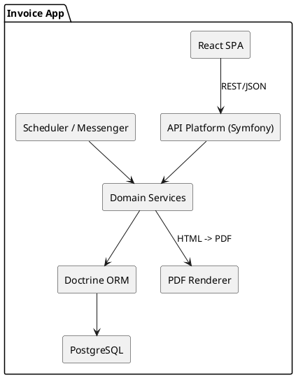
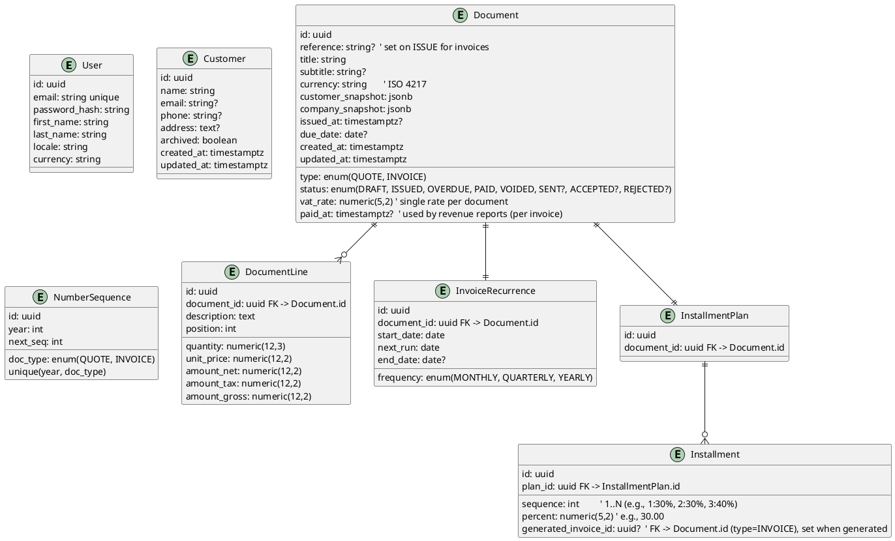

# Invoice Management System specifications

## Background

A personal invoicing and quoting system for a freelance web developer, built to **practice and showcase** a modern stack
while remaining **production-capable** and **contractor-implementable**.

**Key intent**

* Demonstrate a clean, hexagonal architecture with clear domain boundaries.
* Deliver a **single-user** app protected by auth, with pragmatic workflows: quotes, invoices, recurring invoices **or**
  installment plans (mutually exclusive), PDF for documents; CSV for reports, and a concise dashboard.
* Favor **Symfony + API Platform + Doctrine (PostgreSQL, UUIDv7)** on the backend and **React (Vite) + TypeScript/JSX +
  Tailwind + TanStack Query + RHF/Zod** on the frontend.
* Keep operations simple: **Dockerized dev and prod with environment parity** (Compose-based), optional Swarm/Kubernetes
  later, CI/CD via GitHub Actions.

**Out of scope for the MVP**

* Multi-tenant/team features, payments gateways, credit notes, and advanced accounting.
* Complex tax regimes; rely on a **single document-level VAT rate** snapshotted at creation.

**Success criteria (background-level)**

* The system can produce accurate quotes/invoices (including recurring or installment variants), render PDFs, and export
  revenue reports, all for a single authenticated user.
* The spec remains concise and non-overlapping so a scaffolder (codex) can generate a faithful skeleton.

## Requirements

### Product (MoSCoW)

**Must have**

* Single authenticated user (local admin) can manage **customers**, **quotes**, and **invoices**.
* **Company Profile** (embedded in `User`, editable from UI): `company_name`, `phone`, `siret`, full postal address, *
  *legal mentions**, **default VAT rate**, **default hourly rate**, **default daily rate**, and **company logo** (
  VichUploaderBundle). **User** also stores `first_name` and `last_name` (representative), separate from the company
  fields. Changes affect **future** documents only.
* **Document title** (required) and **subtitle** (optional) available on quotes/invoices and rendered in PDF.
* **Quote → Invoice** conversion with immutable snapshot of customer/tax/lines **and company profile** at conversion
  time.
* Document **statuses**: Draft → Sent → Accepted/Rejected (quotes); Draft → Issued → Overdue → Paid/Voided (invoices).
* **Document-level VAT** (single rate per doc), totals with net, tax, gross, rounding to 2 decimals.
* **Either** an **installment plan** *or* a **recurrence** schedule per invoice (mutually exclusive, enforced by domain
  rule).
* **Unique sequential references** per document type (e.g., `INV-YYYY-####`, `Q-YYYY-####`).
* **PDF render** for quotes/invoices; **CSV export** for revenue (by date range/status).
* Basic **dashboard**: totals YTD, MTD, top customers, unpaid/overdue count, upcoming installments/recurrences.
* **Archive/restore customers** (no hard delete of documents).
* **Internationalization-ready** numbers/dates for UI; ISO dates over API.

**Should have**

* **Duplicate** document (clone as Draft), **re-issue** with new reference.
* **Search/filter** lists by customer, status, date range.
* **Rate presets** (common VAT rates) selectable per document.

**Could have**

* **Line-item templates** and **customer defaults** (currency, VAT rate, locale).
* **Tags** on documents for custom reporting.

**Won’t have (MVP)**

* Multi-user/multi-tenant, payment gateways, credit notes, per-line multi-tax, inventory, or accounting journals.

### Non-functional

**Must have**

* **Reliability**: recurrence and installment jobs are idempotent; unique indices prevent duplicates.
* **Performance**: list views return in <300ms P95 on 5k documents; PDF generation <2s P95 for 1–3 pages.
* **Security**: local auth with salted hash; server-side input validation; audit fields (created/updated timestamps &
  user); HTTPS terminated at nginx with **HTTP/2** enabled; self-signed certs in dev (mkcert or equivalent) and managed
  certs in prod.
* **Operability**: Dockerized **dev and prod** with parity; one-command bootstrap; scheduled backups and documented
  restore; production images built via GitHub Actions and published to GHCR; deployment secrets stored in GitHub Secrets.
* **Testability**: unit tests on totals/reference rules; API contract tests for key endpoints; smoke tests for
  PDF/export.
* **Uploads**: logo upload size limit (e.g., 2 MB), accept PNG/JPEG/SVG; store original + generate a constrained
  rendition for PDFs.

**Should have**

* **Accessibility** (WCAG AA baseline) for forms and tables.
* **Observability**: minimal request/DB metrics and job success/failure counters.

**Could have**

* Feature flags for experimental UI.

## Method

### Architecture Overview

* **Style**: Hexagonal (ports/adapters). Domain layer pure PHP; infrastructure via Symfony.
* **Backend**: Symfony (7.x), API Platform (4.x) for JSON:API/Hypermedia, Doctrine ORM (3.x) with PostgreSQL (UUID v7).
* **Frontend**: React 19, Vite, **TypeScript/JSX**, Tailwind, TanStack Query, React Hook Form + Zod.
* **PDF**: server-side HTML → PDF via headless Chromium (containerized) for consistent rendering. Generated files
  streamed on-demand, not stored.
* **Jobs**: Symfony Messenger + schedule (cron) to process recurrences and to mark overdue.
* **Containers**: Dev **and** Prod run in Docker with the same entrypoints and envs (12‑factor); multi-stage images;
  docker-compose for local and single-host prod.



### Domain Model & Persistence

#### Core Entities

* **User** (single admin)
* **Customer**: identity & contact snapshot copied onto documents
* **Document** (abstract): common fields + concrete types **Quote** and **Invoice**
* **DocumentLine**: quantity, unit price, description, snapshots
* **InvoiceRecurrence** *(mutually exclusive with installments)*
* **InstallmentPlan** + **Installment** *(mutually exclusive with recurrence)*
* **NumberSequence**: per-year, per-type counters



#### Table Notes

* **Document.customer_snapshot** contains a denormalized copy of the Customer fields at creation/conversion time (
  immutability of documents).
* **Totals** are materialized on **Document** to speed up lists; lines also store `line_total_net` to avoid recompute.
* **Mutual exclusivity** enforced by DB constraints + domain checks: a document can have *either* a row in
  `InvoiceRecurrence` *or* in `InstallmentPlan` (but not both). Use partial unique indexes.

### Doctrine Mapping Strategy (STI)

**Goal:** keep a single `document` table while modeling `Quote` and `Invoice` as separate Doctrine entities.

* **Inheritance:** Doctrine `SINGLE_TABLE` with discriminator column named `type` and values `QUOTE` / `INVOICE`.
* **Lines relation:** `DocumentLine` → `Document` (ManyToOne), and `Document` → `DocumentLine` (OneToMany) defined on
  the abstract `Document` class.
* **Invoice-only relations:** map recurrence and installment associations **to `Invoice` only** in the ORM. At the
  database level the FK still targets `document.id`.
* **Polymorphic queries:** use DQL `INSTANCE OF` (or API Platform subresources) to fetch only invoices or only quotes.
* **DB guards:** keep a discriminator `CHECK` constraint on `document.type`. Add small constraint triggers on
  `invoice_recurrence` and `installment_plan` that assert the referenced `document` row has `type = 'INVOICE'`.
* **Repository guidance:** provide dedicated repository methods such as `InvoiceRepository::findOverdue()` that scope by
  child type to avoid accidental mixed-type queries.
* **Serialization:** expose parent `Document` with read‑only `type`, and optionally expose child resources (`/invoices`,
  `/quotes`) for convenience.

### Numbering & Status Rules

* **Reference pattern**: `INV-YYYY-####` and `Q-YYYY-####` (per-year reset, zero-padded 4+ digits).
* **Atomically** increment via `NumberSequence`: `SELECT ... FOR UPDATE` within a transaction.
* **Quote lifecycle**: `DRAFT → SENT → ACCEPTED|REJECTED` (immutable after decision except notes).
* **Invoice lifecycle**: `DRAFT → ISSUED → OVERDUE → PAID|VOIDED`.
* **Conversion**: Quote → Invoice copies snapshot + lines; creates new reference; quote marked ACCEPTED.

### Totals & Rounding

* **Line total (net)** = `quantity * unit_price` → round to 2 decimals at line level.
* **Subtotal (net)** = sum(line_total_net).
* **Tax total** = `round(subtotal_net * vat_rate/100, 2)`.
* **Grand total** = `subtotal_net + tax_total`.
* **Installments**: split the seed **grand total** by percentages to compute each **installment invoice** amount; apply
  any rounding residual to the **last generated invoice** to keep the series sum exact.

### Recurrence & Installments

* **Recurrence job** (daily): for each `InvoiceRecurrence` whose `next_run <= today`, clone the invoice as a new Draft
  with same lines & VAT; advance `next_run` by frequency; stop at `end_date` if set.
* **Subtitle injection for recurring drafts**: when generating a draft, automatically set `Document.subtitle` to the
  covered period:

    * **MONTHLY**: e.g., `"March 2026"`.
    * **QUARTERLY**: e.g., a run on **April 1, 2026** sets `"January, February and March 2026"`.
    * **YEARLY**: `"2026"`.
    * Localize month names by `User.locale`.
* **Overdue job** (daily): move `ISSUED` invoices with `due_date < today` to `OVERDUE`.
* **Installment plan**: attach a percent-only plan (sums to 100%) to a Quote or Invoice; **generates one Draft invoice
  per installment** (e.g., 30%, 30%, 40%) with its own reference & totals. Mark each **installment invoice** as `PAID`
  with a `paid_at` date. Show the project full total on each installment PDF for context. The **seed cannot be issued**.

### API Surface (API Platform resources)

* `/auth/*` (login/logout)
* `/me` (GET/PUT) – **edit full user** including `first_name`, `last_name`, `locale`, `currency`, password update, and
  the
  **embedded CompanyProfile** fields in one payload
* `/me/company-logo` (POST) – VichUploaderBundle endpoint for company logo upload; returns updated path stored in
  embedded profile
* `/customers` (CRUD, archive)
* `/documents` (list with filters: type, status, dates, customer)
* `/documents/{id}` (CRUD)
* `/documents/{id}/actions`: `convert-to-invoice`, `duplicate`, `issue`, `reissue`, `void`, mark-paid — `issue` is
  blocked if the document has an InstallmentPlan (use plan → generate).
* `/documents/{id}/installment-plan` (GET/POST)
* `/installment-plans/{plan_id}/generate` (POST → per‑installment invoices as Draft)
* `/recurrences` (CRUD)
* `/reports/revenue.csv?from&to&customer_id&sort`
    - CSV mirrors the visible rows and filters (same scope/order) and appends a final `Total` row matching the on-screen
      grand total. Filtering, ordering, and totals are based on `paid_at` (payment date), not `issued_at`.
* `/pdf/{id}` (stream PDF)

### Validation & Invariants

* Document must have ≥1 line; amounts non-negative; currency ISO 4217.
* **Either recurrence or installments** (never both) enforced by domain service prior to `ISSUE`.

- **Guardrail:** `ISSUE` on a document that has an **InstallmentPlan** is **forbidden** (HTTP 422). The seed remains *
  *DRAFT**; use `/installment-plans/{plan_id}/generate` to produce installment invoices (Draft → can be issued).
- For documents with an **InstallmentPlan**, the **seed document** (the one holding the plan) must remain **DRAFT** and
  is **excluded from revenue/exports**; only the **generated installment invoices** are counted in revenue.

* `ISSUE` requires reference assigned; `VOID` requires `DRAFT` or `ISSUED` with no payments.

### Frontend Key Screens

* **Dashboard**: KPIs (YTD, MTD, unpaid, overdue, upcoming recurrences/installments).
* **Customers**: list, archive/restore.
* **Quotes/Invoices**: list with filters; editor form with live totals; action drawer (issue, convert, duplicate).
* **PDF preview**: server-rendered or client-opened via `/pdf/{id}`.
* **Revenue**: list with filters/grand total, export

## Implementation

### Global Implementation Plan & Standards (for scaffolding)

**Repository structure**

* `backend/` (Symfony), `frontend/` (Vite + React + TypeScript + Tailwind), `ops/` (Dockerfiles, compose, CI).

**Coding standards**

* PHP: PHP 8.4+, PSR-12, type-hints everywhere, strict types, Rector for refactors, PHP-CS-Fixer, PHPStan level max.
* JS/TS: TypeScript **strict** mode, ESLint (typescript-eslint), Prettier, path aliases via `tsconfig.json`.
* Commit style: Conventional Commits; enforce via commitlint (optional).

**API standards**

* API Platform resources with OpenAPI documented; consistent problem-details errors (`application/problem+json`).
* No URI versioning (single-user app); keep a single API; pagination/filtering standards on list endpoints.
* Input validation mirrored on client (Zod) and server (Symfony validators).

**Database & Migrations**

* Doctrine migrations per change; naming: `V{timestamp}__{slug}`; no raw DDL outside migrations.
* Naming: snake_case tables/columns; `id` as UUID v7; timestamps as `timestamptz`.

**Containers & Dev/Prod parity**

* Multi-stage Dockerfiles: builder (deps, assets) → runtime (php-fpm/alpine) for backend; Node builder → Nginx static
  for frontend (immutable assets).
* `compose.dev.yml` for local; `docker-stack.yml` for **Docker Swarm** single-host prod with the same
  services/entrypoints/envs; secrets via Swarm secrets.
* Healthchecks for web/db; `.env` files only for local—secrets injected via env vars in prod; host-level dependencies
  limited to Docker Engine and a certificate renewal timer.
* TLS parity: dev stack runs nginx with self-signed certificates (supporting Vite HMR + PHP-FPM over HTTPS/HTTP/2);
  prod uses real certificates with identical TLS config. Certbot renewals handled via host `cron`/`systemd` script that
  runs the containerized `certbot` client and reloads nginx—no long-running socket access inside containers.

**Security**

* Password hashing via sodium/argon2id; rate-limit login; CORS locked to frontend origin; HTTPS + HTTP/2 enforced in
  the reverse proxy; dev uses self-signed certs mirroring prod TLS behaviour.

**Observability**

* Access logs, minimal app logs, DB slow query log; Prometheus-ready metrics counters (requests/jobs) where easy.

**Frontend stack**

* React 19 + Vite + **TypeScript/JSX** + **Tailwind**.
* State/data: TanStack Query; forms: RHF + Zod; routing with React Router.
* Tailwind: `@tailwind base; @tailwind components; @tailwind utilities;` with a small design token config.

**Build & CI/CD**

* GitHub Actions: PHP static analysis & tests; JS lint & typecheck; docker buildx multi-arch images; push to registry;
  deploy via **Docker Swarm** (`docker stack deploy -c ops/docker-stack.yml app`).

**Scaffolding checklist**

* Entities/resources: User (+ embedded CompanyProfile), Customer, Document (STI), DocumentLine, InvoiceRecurrence,
  Installment, NumberSequence.
* Controllers/processors: document actions; `/me` provider/processor; logo upload.
* Services: NumberSequenceService, DefaultPricingService, SnapshotService, TotalsService, RecurrenceService,
  PdfRenderer.
* Frontend pages: Dashboard, Customers, Quotes, Invoices, Settings (user + company profile + logo).
* Reusable UI: Form controls, table, pagination, date pickers, toast/alert components.

## Ops Scaffold (minimal)

> These are **skeletons** intended for quick start; teams can expand as needed.

**backend/Dockerfile**

```dockerfile
# ---- builder ----
FROM php:8.4-fpm-alpine AS builder
RUN apk add --no-cache git unzip libpq-dev && docker-php-ext-install pdo_pgsql
COPY --from=composer:2 /usr/bin/composer /usr/bin/composer
WORKDIR /app
COPY backend/composer.json backend/composer.lock ./
RUN composer install --no-dev --no-interaction --prefer-dist --no-scripts
COPY backend/ .
RUN composer dump-autoload --optimize

# ---- runtime ----
FROM php:8.4-fpm-alpine AS runtime
RUN apk add --no-cache libpq
WORKDIR /app
COPY --from=builder /usr/local/etc/php/php.ini-production /usr/local/etc/php/php.ini
COPY --from=builder /app /app
CMD ["php-fpm", "-F"]
```

**frontend/Dockerfile**

```dockerfile
# ---- build ----
FROM node:20-alpine AS build
WORKDIR /app
COPY frontend/package.json frontend/package-lock.json ./
RUN npm ci
COPY frontend/ .
RUN npm run build

# ---- serve static ----
FROM nginx:alpine
COPY --from=build /app/dist /usr/share/nginx/html
COPY ops/conf.d/nginx.conf /etc/nginx/conf.d/default.conf
```

**ops/nginx.conf**

```nginx
server {
  listen 80;
  root /usr/share/nginx/html;
  index index.html;
  location /api/ { proxy_pass http://backend:8000/; }
  location / { try_files $uri /index.html; }
}
```

**ops/compose.dev.yml**

```yaml
services:
    db:
        image: postgres:18-alpine
        environment:
            POSTGRES_USER: app
            POSTGRES_PASSWORD: app
            POSTGRES_DB: app
        volumes: [ dbdata:/var/lib/postgresql/data ]
    backend:
        build: { context: ., dockerfile: ops/Dockerfile }
        environment:
            DATABASE_URL: postgresql://app:app@db:5432/app?serverVersion=18&charset=utf8
        depends_on: [ db ]
        ports: [ "8000:9000" ] # php-fpm behind caddy/nginx locally if desired
    frontend:
        build: { context: ., dockerfile: frontend/Dockerfile }
        ports: [ "5173:80" ]
volumes:
    dbdata: { }
```

**ops/docker-stack.yml** (Swarm, single host)

```yaml
version: "3.8"
services:
    db:
        image: postgres:18-alpine
        environment:
            POSTGRES_USER: app
            POSTGRES_PASSWORD_FILE: /run/secrets/db_password
            POSTGRES_DB: app
        volumes:
            - dbdata:/var/lib/postgresql/data
        secrets: [ db_password ]

    backend:
        image: ghcr.io/you/invoices-backend:latest
        environment:
            DATABASE_URL: postgresql://app:${DB_PASSWORD}@db:5432/app?serverVersion=18&charset=utf8
        deploy: { replicas: 1 }
        depends_on: [ db ]

    frontend:
        image: ghcr.io/you/invoices-frontend:latest
        ports: [ "80:80" ]
        deploy: { replicas: 1 }

volumes: { dbdata: { } }
secrets:
    db_password:
        external: true
```

**Makefile (optional, minimal)**

```makefile
up:
	docker compose -f ops/compose.dev.yml up -d --build

down:
	docker compose -f ops/compose.dev.yml down

deploy:
	docker stack deploy -c ops/docker-stack.yml invoices
```

## Milestones

**M1 – Foundations (week 1)**

* Repos, CI, Dockerfiles, compose (dev) + Swarm stack (prod), base Symfony app, Vite React TS + Tailwind scaffold.

**M2 – Domain & Persistence (week 2)**

* Entities (User+embedded CompanyProfile, Customer, Document STI, DocumentLine, Recurrence/Installments,
  NumberSequence) + migrations.
* STI constraints & triggers, repositories, basic fixtures.

**M3 – API Resources & Auth (week 3)**

* API Platform resources, filters, `/me` provider/processor (+ password change), logo upload endpoint.
* Document actions processors (`issue`, `convert`, etc.).

**M4 – Frontend MVP (week 4)**

* Routes & pages: Settings (company+user), Customers, Quotes, Invoices.
* Forms with RHF+Zod, list tables with filters, PDF streaming.

**M5 – Jobs & PDF (week 5)**

* Recurrence & overdue schedulers, subtitle generation.
* Browsershot PDF renderer with minimal theme.

**M6 – Hardening (week 6)**

* Tests (unit/API/E2E smoke), a11y pass, performance pass on lists & PDF, logging/metrics.
* Swarm deploy script & checklist.

## Gathering Results

**Validation checklist**

* Can create/edit customers; create quotes/invoices with title/subtitle and line defaults.
* Quote→Invoice conversion snapshots user company + customer correctly.
* Recurring drafts include localized period subtitle for monthly/quarterly/yearly.
* PDFs render with logo and legal mentions; CSV exports correct.
* Single-user auth, password change via `/me`, logo upload works.
* Dev=Prod parity verified on Swarm; backups & persistence validated.

**Success metrics**

* P95 list endpoint <300ms on 5k docs; PDF render <2s P95.
* 0 failed recurrence jobs over a week; 100% passing tests in CI.

**Post-launch**

* Collect feedback; prioritize Could-haves (templates, tags) and optional Swarm -> multi-node.
